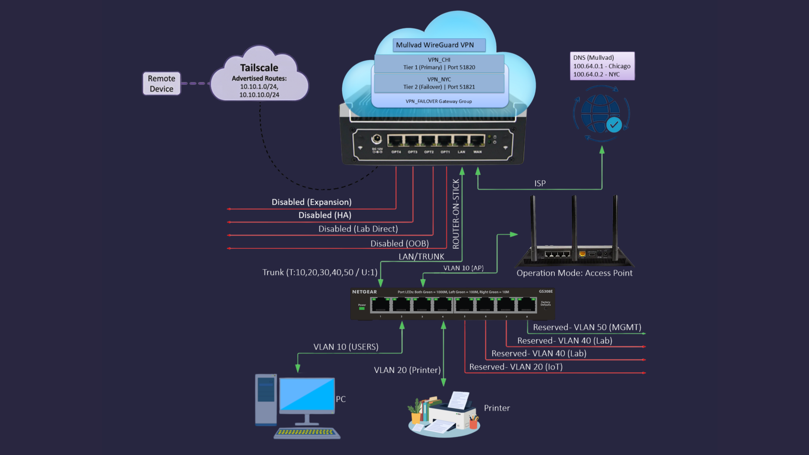
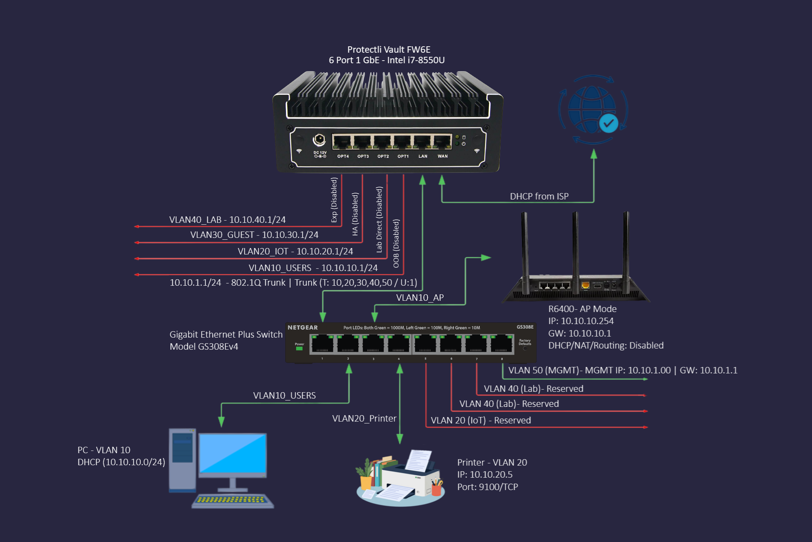

# Homelab - pfSense Router-on-a-Stick

A home network I've been building to learn VLANs, firewall rules, and VPN tunneling from scratch. It runs pfSense with VLAN segmentation, dual-VPN failover, and a layered kill switch to prevent leaks.

Nothing enterprise-grade - just a small lab where I can break things, learn from mistakes, and slowly build something I actually understand. Documented so I remember why I made each decision, and in case it helps someone else who's starting out.

---

## Hardware

| Device | Role |
|---|---|
| Protectli FW6E (i7, 16GB RAM) | Firewall / Router - pfSense 2.8.1 |
| Netgear GS308E v4 | Managed switch - 802.1Q trunk |
| Netgear R6400 | Wi-Fi access point - AP mode only (see [Known Limitations](#known-limitations)) |
| Cisco Catalyst 3560 + Cisco 1900 | Lab gear - isolated on VLAN 40 |

---

## Network Architecture

**Topology:** Router-on-a-Stick - all VLANs ride a single 802.1Q trunk on `igb1`. I keep the subnet third-octet matching the VLAN ID (e.g. `10.10.20.x` = VLAN 20) so logs are easier to read at a glance.

| Interface | VLAN | Subnet | Purpose |
|---|---|---|---|
| igb0 | - | DHCP from ISP | WAN |
| igb1 | 1 (Native) | 10.10.1.0/24 | Trunk uplink / switch management |
| igb1.10 | 10 | 10.10.10.0/24 | Trusted devices - PCs, phones, Wi-Fi |
| igb1.20 | 20 | 10.10.20.0/24 | IoT - printers, smart devices |
| igb1.30 | 30 | 10.10.30.0/24 | Guest Wi-Fi |
| igb1.40 | 40 | 10.10.40.0/24 | Cisco lab gear - fully isolated |
| igb1.50 | 50 | 10.10.50.0/24 | Management - direct WAN, no VPN |

Ports `igb2`-`igb5` are reserved for future use (OOB, Lab Direct, HA, Expansion) - currently disabled.

---

## VPN & Kill Switch

Two Mullvad WireGuard tunnels with automatic failover:

- `VPN_CHI` - Chicago (primary)
- `VPN_NYC` - New York City (failover)
- `VPN_FAILOVER` gateway group handles automatic promotion if the primary goes down

If both tunnels drop, traffic gets blocked - not leaked. That's handled by a few layers working together:

1. **Outbound NAT** - 12 manual rules map internal subnets to VPN interfaces only. There are zero explicit WAN outbound NAT rules, so if both tunnels are down, traffic has nowhere to go.
2. **DoH/DoT block** - Prevents encrypted DNS bypass on ports 443-853.
3. **Port 53 block** - No plain DNS to WAN.
4. **RFC1918 block** - Blocks all inter-VLAN traffic (full /8, /12, /16 ranges).
5. **IPv6 block** - All IPv6 dropped to prevent tunnel leak vectors.

**DNS** is locked to Mullvad's resolvers through the VPN tunnels (`100.64.0.1` for CHI, `100.64.0.2` for NYC). There's no ISP DNS fallback - not even during failover.

**VLAN 50** is the one exception - it bypasses VPN and inter-VLAN rules on purpose. It's there for emergency admin access when something breaks and I need to reach the firewall or other VLANs directly.

---

## Diagrams

| | |
|---|---|
|  |  |
| Network topology overview | VLAN and IP assignment detail |

---

## Repository Structure

```
Homelab_Router-on-a-Stick/
├── .gitignore
├── README.md
├── CHANGELOG.md
├── LICENSE
│
├── configs/                         # Config breakdowns in readable markdown
│   ├── firewall-rules.md
│   ├── nat-rules.md
│   ├── vlan-assignments.md
│   ├── switch-port-map.md
│   └── vpn-failover.md
│
├── diagrams/                        # Network topology and VLAN diagrams
│   ├── network-topology.png
│   ├── vlan-ip-detail.png
│   ├── FW6E.png
│   ├── GS308E.png
│   └── R6400.png
│
├── docs/                            # Full PDF manuals (detailed writeups)
│   ├── HOME_LAB_v2.pdf
│   ├── FIREWALL_RULES_MANUAL.pdf
│   └── SWITCH_VLAN_MANUAL.pdf
│
└── screenshots/                     # Verification screenshots
    ├── ipleak.png
    └── mullvad.png
```

---

## Documentation

**Config breakdowns** - written to explain the reasoning, not just list settings:

- [`firewall-rules.md`](configs/firewall-rules.md) - Per-VLAN rule chains, top-to-bottom order
- [`nat-rules.md`](configs/nat-rules.md) - All 12 manual outbound NAT rules
- [`vlan-assignments.md`](configs/vlan-assignments.md) - Interface, subnet, and purpose map
- [`switch-port-map.md`](configs/switch-port-map.md) - GS308E port-by-port VLAN assignments
- [`vpn-failover.md`](configs/vpn-failover.md) - WireGuard tunnel config and gateway group logic

**Full PDF manuals** - detailed writeups with pfSense UI screenshots in [`/docs`](docs/):

- [`HOME_LAB_v2.pdf`](docs/HOME_LAB_v2.pdf) - Full architecture writeup
- [`FIREWALL_RULES_MANUAL.pdf`](docs/FIREWALL_RULES_MANUAL.pdf) - Firewall rules manual
- [`SWITCH_VLAN_MANUAL.pdf`](docs/SWITCH_VLAN_MANUAL.pdf) - Switch and VLAN manual

---

## What I've Tested

- **No IP/DNS/WebRTC leaks** - confirmed via [ipleak.net](https://ipleak.net) and [Mullvad Check](https://mullvad.net/en/check) ([ipleak screenshot](screenshots/ipleak.png)) ([mullvad screenshot](screenshots/mullvad.png))
- **VPN failover works** - CHI to NYC promotion confirmed by killing the primary tunnel
- **Inter-VLAN isolation holds** - cross-VLAN pings blocked as expected
- **Kill switch works** - both tunnels down means no traffic reaches WAN

---

## Roadmap

| Item | Status | Notes |
|---|---|---|
| Tailscale remote access | Done | Advertised routes configured and tested - March 2026 |
| Suricata IDS | Done | Deployed on pfSense 2.8.1 alongside pfBlockerNG-devel |
| AP hardware upgrade | On hold | Not planned right now - may revisit later with a VLAN-aware AP |
| Guest rate limiting | On hold | Deferred - R6400 hardware doesn't support VLAN-aware SSIDs |
| Centralized logging | Exploring | Syslog server for firewall and IDS alerts |
| Switch port hardening | Planned | Move unused GS308E ports off VLAN 1 native into a dead VLAN |

---

## Known Limitations

**Guest Wi-Fi isn't fully separated yet.**
The R6400 can't do 802.1Q tagging, so the guest SSID lands on VLAN 10 with trusted devices. AP-level client isolation is enabled, but that's not the same as real VLAN separation. This is the biggest gap right now.

**VLAN 40 is noisy.**
Cisco lab gear throws a lot of protocol traffic (CDP, STP, etc.). VLAN 40 is excluded from Suricata monitoring to avoid alert floods. It's still fully isolated by firewall rules.

**What's not in this repo.**
WireGuard private keys and switch binary configs stay local. The markdown files in `configs/` are the sanitized, shareable versions. Some real IPs show up in diagrams and docs - that's intentional for a homelab, but no credentials are committed here.
