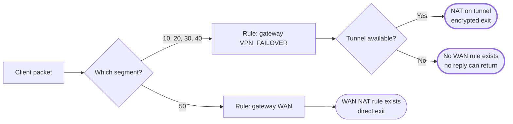

<div align="center">

# Homelab: pfSense Router-on-a-Stick

**A home network where nothing reaches the internet outside an encrypted tunnel.**


[](LICENSE)


**6 segments · 7 egress controls · 2 VPN tunnels · 5 documented post-mortems**
**980,000 alerts analysed to find one root cause · 27 → 519 Mbps**

</div>

<p align="center">
  
</p>

The kill switch is the **absence** of a rule, not the presence of one. No rule permits unencrypted traffic to the internet, so a leak would have to be created rather than allowed.

The interesting part of this repository is not the configuration. It is what happened when the configuration was wrong.

---

## How this lab is run

**Verify the config file, not the interface.** The UI showed the intended state while the config disagreed. Twice.

**Anything silently reversible needs a detector.** Three correct fixes were undone without notice, one for six weeks. The fourth shipped with an hourly check.

**Measure the distribution before chasing the signature.** One rule set was 99.5% of 980,000 alerts. Counting the log took seconds; reading it had taken six weeks.

**Accept risk explicitly.** Where a control is absent, the threat model and the conditions to revisit it are written down. [Worked example](docs/LIMITATIONS.md).

Failures are documented with root cause and reattempt criteria, including my own mistakes.

---

## Recent work

| Date | Change |
|---|---|
| **2026-09-20** | Intrusion detection silently blocked legitimate services for six weeks after a config restore undid an earlier fix. It looked like Wi-Fi slowness, because blocked packets are dropped silently and clients wait out a timeout. Fixed, and a detector added. |
| **2026-08-06** | Wi-Fi ran at 27 Mbps instead of 519. The access point and switch disagreed on one segment's label, forcing a slow software path. Every RF metric read healthy. Found by comparing two SSIDs on the same radio. |

<details>
<summary><b>See more</b></summary>

| Date | Change |
|---|---|
| **2026-09-20** | Wireless raised to WPA2/WPA3 with Protected Management Frames. Backups encrypted; they had held tunnel private keys in a cloud-synced folder. |
| **2026-08-06** | Removed admin access from the management segment. It is broadcast as a wireless network, so its password reached the firewall from outside the building. |
| **2026-08-06** | Address translation rules still pointed at a deleted tunnel. Three segments had no internet for an unknown period. |
| **2026-08-06** | Three latent tunnel faults: a health check watching itself, a missing packet-size limit, a DNS server with no route. |
| **2026-06-04** | Rebuilt DNS resilience after the resolver silently stopped answering. Parts were later disproven under test. |

</details>

Full history in [CHANGELOG.md](CHANGELOG.md).

---

## Segments

| Segment | Holds | Internet path |
|---|---|---|
| 10 | Trusted computers and phones | VPN tunnel |
| 20 | Smart devices and printer | VPN tunnel |
| 30 | Guests | VPN tunnel, no local access |
| 40 | Cisco practice lab | VPN tunnel, no other segment |
| 50 | Management | Direct, no VPN, no admin rights |

Third octet matches the segment ID, so `10.10.20.5` is recognisably segment 20 in any log.

<details>
<summary><b>Addressing detail</b></summary>

<p align="center">
  
</p>

</details>

---

## Egress controls

Seven layers. A packet must defeat all of them to leave unencrypted.

| Control | What it does |
|---|---|
| Address translation lock | Only VPN tunnels rewrite addresses outbound. One exception, segment 50 |
| Encrypted DNS block | Apps cannot use hidden DNS to bypass the resolver |
| Plain DNS block | No direct queries to outside DNS servers |
| Segment isolation | Private ranges blocked between segments by default |
| IPv6 dropped | Dual-stack doubles the rule surface and adds silent failure modes |
| Resolver lock | DNS leaves only through the active tunnel |
| Fail closed | Both tunnels down means no usable egress. No translation exists, so no reply can return |


```mermaid
flowchart LR
    A[Client packet] --> B{Which segment?}
    B -->|10, 20, 30, 40| C[Rule: gateway VPN_FAILOVER]
    B -->|50| D[Rule: gateway WAN]
    C --> E{Tunnel available?}
    E -->|Yes| F([NAT on tunnel<br/>encrypted exit])
    E -->|No| G([No WAN rule exists<br/>no reply can return])
    D --> H([WAN NAT rule exists<br/>direct exit])

    style F stroke-width:3px
    style G stroke-width:3px
```

The branch is decided by segment, not by failure. Segments 10 to 40 have no WAN translation, so if both tunnels drop the packet keeps a private source address and no reply can reach it. A leak would need a rule added, not removed.

Segment 50 is the deliberate exception, routed to WAN by its own rule rather than falling back to it. That keeps the firewall reachable when the tunnels themselves are the fault. It holds no admin rights.

---

## Verification

Tested, not assumed. Procedures in [testing-procedures.md](operations/testing-procedures.md).

| Test | Result |
|---|---|
| IP, DNS, WebRTC leaks | None. [Evidence](assets/screenshots/ipleak.png) |
| VPN failover | Secondary took over, nothing escaped during the switch |
| Segment isolation | Cross-segment access blocked |
| Kill switch | Both tunnels down, no traffic reached the internet, real address never appeared |

The central claim is provable in one command. Count the WAN translation rules:

```sh
pfctl -sn | grep 'nat on igb0'
```

One line returns, for segment 50. Nothing exists for segments 10 to 40, which is the kill switch: an absence you can verify, not a rule you have to trust.

---

## Known limitations

| Limitation | Detail |
|---|---|
| Observability | No metrics or dashboards. Every incident here was detected late. The main open gap |
| One firewall | No redundant pair. A port is reserved for a second unit |
| Switch tier | No management VLAN, no ACLs, no port security. Caps hardening. [Post-mortem](docs/LIMITATIONS.md) |
| IDS blocking is network-wide | The block list applies everywhere at once, not per segment. Caused four outages. [Post-mortem](docs/LIMITATIONS.md) |
| No second factor on login | pfSense offers none natively. Risk accepted, reasoning recorded. [Detail](docs/LIMITATIONS.md) |

---

## Hardware

| | |
|---|---|
| Firewall | Protectli FW6E, pfSense 2.8.1 |
| Switch | Netgear GS308E v4 |
| Wi-Fi | UniFi U7 Lite, 3 tagged SSIDs (upgraded from a Netgear R6400, May 2026) |
| VPN | Mullvad WireGuard, 2 tunnels, automatic failover |
| Monitoring | Suricata IDS, pfBlockerNG DNS filtering |
| Remote access | Tailscale, scoped to one segment |
| Applications | Mac Mini M4, Docker |
| Practice lab | Cisco Catalyst 3560 + 1941, isolated |
| Cost | $3,999+ once, ~$199/year |

> Reproducible for **$499 to $999** with a used firewall and switch, an access point you already own, and this stack, which is entirely free. The spend above reflects headroom and learning, not the minimum.

---

## Documentation

<details>
<summary><b>Full index</b></summary>

**Network**

| Document | Scope |
|---|---|
| [vlan-assignments.md](network/vlan-assignments.md) | Interface, segment and address map |
| [switch-port-map.md](network/switch-port-map.md) | Port allocation, access point trunk |
| [firewall-rules.md](network/firewall-rules.md) | Rule chains per segment, and ordering |
| [nat-rules.md](network/nat-rules.md) | The translation design behind the kill switch |

**VPN and DNS**

| Document | Scope |
|---|---|
| [vpn-failover.md](vpn/vpn-failover.md) | Tunnels, failover groups, build checklist |
| [dns-resilience.md](vpn/dns-resilience.md) | Four layers, including what was later disproven |

**Services**

| Document | Scope |
|---|---|
| [pfblockerng.md](services/pfblockerng.md) | DNS filtering groups, update policy |
| [tailscale.md](services/tailscale.md) | Routes and restrictions |
| [mac-mini/](services/mac-mini/) | Application host |

**Operations**

| Document | Scope |
|---|---|
| [backup-procedure.md](operations/backup-procedure.md) | Encrypted export and restore |
| [testing-procedures.md](operations/testing-procedures.md) | Isolation, kill switch, failover, leak tests |

**Reference**

| Document | Scope |
|---|---|
| [LIMITATIONS.md](docs/LIMITATIONS.md) | Post-mortems, root causes, reattempt criteria |
| [technical-guide.md](docs/technical-guide.md) | 29-section build writeup |
| [docs/exports/](docs/exports/) | PDF and Word exports |
| [labs/ccna/](labs/ccna/) | Cisco practice lab |
| [archive/](archive/) | Retired hardware |

</details>

---

## Roadmap

<details>
<summary><b>Planned and completed</b></summary>

| Item | Status |
|---|---|
| Wi-Fi 7 access point | Done, May 2026 |
| Guest network on its own segment | Done, May 2026 |
| Dedicated recovery port | Done, May 2026 |
| Wireless hardening, WPA2/WPA3 with PMF | Done, September 2026 |
| Observability: metrics, dashboards, alerting | Next. Closes the detection gap behind every incident |
| Configuration drift detection | Next. A restore has reverted security settings twice |
| Threat rules on internal segments | Detection-only first |
| Outbound filtering for smart devices | Planned |
| Managed switch replacement | Planned. Unblocks port security |
| Redundant firewall pair | Under consideration |
| CCNA exam | Scheduled, October 2026 |

</details>

---

## Background

System administrator and network engineer, 7+ years across healthcare, education and MSP environments. Active Directory, Intune, pfSense, HIPAA compliance.

This lab is where ideas get tested before they inform production work, and where the failures get written down.

[ajayangdembe.com](https://www.ajayangdembe.com)

---

## License

MIT. See [LICENSE](LICENSE). Use and adapt freely; keep the copyright notice and a link back if you republish substantial parts.

<div align="center">

*[Aj-Networks](https://github.com/Aj-Networks)*

</div>
