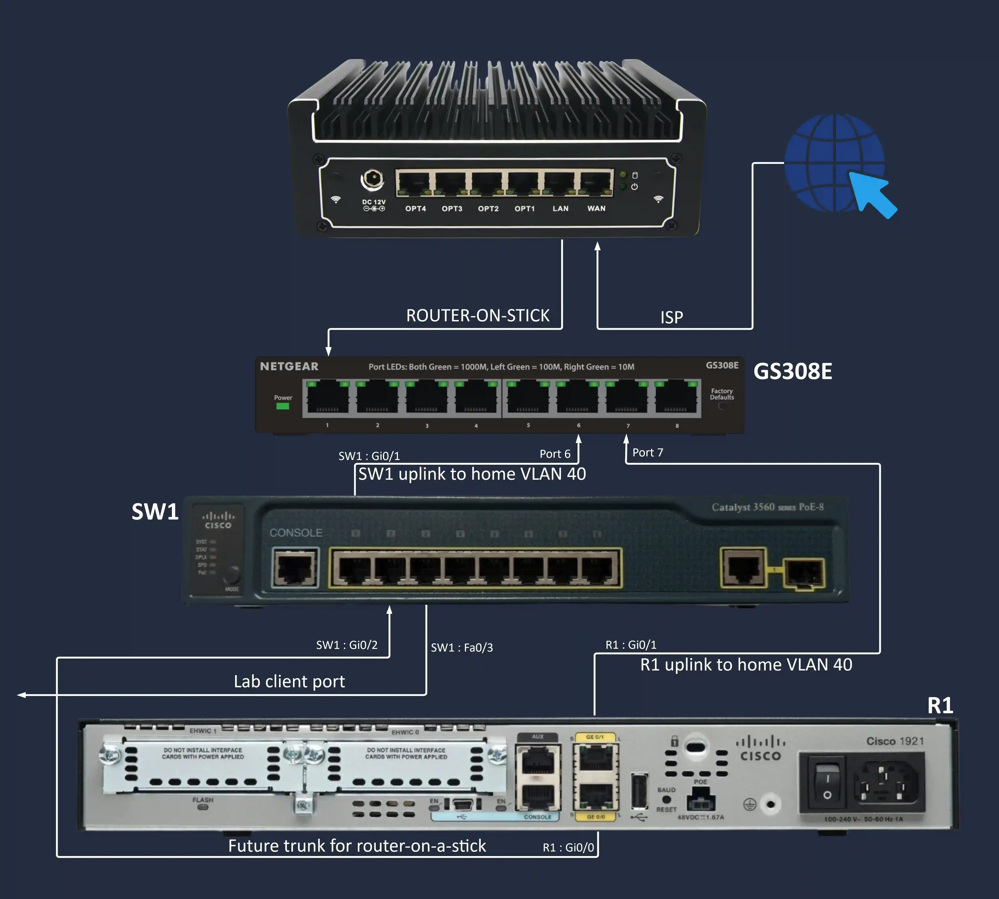

# CCNA Lab folder

All hands-on Cisco gear documentation for the home CCNA lab. Hardware: Cisco Catalyst 3560 (`SW1`) + Cisco 1900 ISR (`R1`), uplinked into the home lab via VLAN 40.

## Topology

## Contents

| Item | What it is |
|---|---|
| [`ccna-lab.md`](ccna-lab.md) | The lab plan: topology, IP scheme, baseline configs, phase progression (0-16), house rules |
| [`cable-labels.docx`](cable-labels.docx) | Printable cable label sheet, cut and wrap around each cable end |
| [`topology/`](topology/) | Topology diagrams (e.g. `ccna.webp`). Source-of-truth visuals for the lab layout |
| [`show-runs/`](show-runs/) | Per-phase `show running-config` dumps, one per device per phase |
| [`screenshots/`](screenshots/) | PuTTY captures, ping output, verification screenshots |

## How to use this folder

### After completing a phase
1. From the device console: `show running-config`
2. Copy/paste full output into `show-runs/<device>-phase<N>.txt` (e.g. `SW1-phase3.txt`, `R1-phase4.txt`)
3. **Strip secrets first** - remove `enable secret 5 ...` and `password 7 ...` lines before committing. They are not safe in git even encrypted.
4. Commit with message like `add: SW1 phase 3 show-run`

### After verification screenshots
1. PuTTY: right-click title bar > Copy All to Clipboard, paste into a text file in `screenshots/` for terminal output, or use Windows snip for ping/diagnostic visuals
2. Name the file `<device>-phase<N>-<what>.png|txt` (e.g. `SW1-phase3-pingtest.png`)

### Naming convention
- `<device>-phase<N>-<descriptor>.<ext>`
- `device` = SW1 or R1 (or LabPC)
- `phase` = matches the phase number in `ccna-lab.md`
- Lowercase, hyphens not spaces

## Quick links

- Phase progression table: [`ccna-lab.md` Phase progression section](ccna-lab.md#phase-progression)
- Topology: [`ccna-lab.md` Topology section](ccna-lab.md#topology)
- Connection list / cable map: see `cable-labels.docx` reference table at bottom of the print sheet
- IP plan: [`ccna-lab.md` IP addressing plan section](ccna-lab.md#ip-addressing-plan)

## Related (outside this folder)

- Home lab overall: [`../../README.md`](../../README.md)
- Home VLAN assignments: [`../vlan-assignments.md`](../vlan-assignments.md)
- GS308E port map (where SW1 / R1 / Lab PC plug in): [`../switch-port-map.md`](../switch-port-map.md)
- pfSense firewall context: [`../firewall-rules.md`](../firewall-rules.md)
- Backup workflow this folder follows: [`../backup-procedure.md`](../backup-procedure.md)
