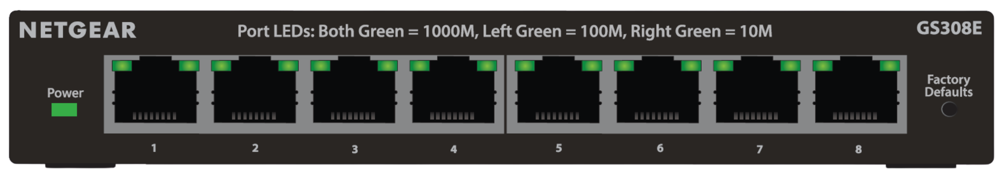
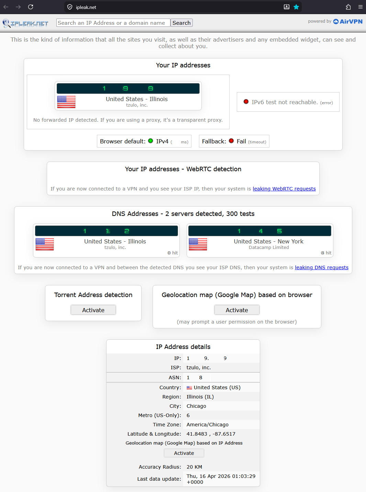
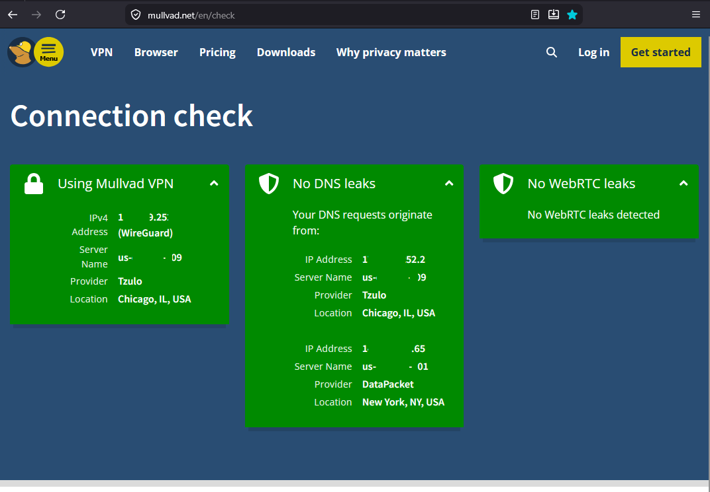

# Featured Build Showcase, Layout Demo

Four different ways to show your raw build photos and videos on the project page. Each style below uses existing repo images as placeholders labelled `Image 1`, `Image 2`, etc. Pick the layout you like, copy its markdown into the main `README.md` under a new `## Featured Build` section, and swap the placeholder images for your real build shots.

---

## Style 1: Numbered Tour (storytelling)

A chronological walkthrough. Each photo gets a number and a short caption. Reads like a documentary, gives every image breathing room.

### Image 1


*One line caption goes here.*

### Image 2



*One line caption goes here.*

### Image 3


*One line caption goes here.*

**Best for:** building a narrative, "how I got from A to B", chronological progress shots.

---

## Style 2: Hero plus Thumbnails

One large feature image up top, smaller supporting shots in a row below. Maximum visual impact for the headline image, but still room for detail.


*Hero caption goes here.*

|  |  |  |
|:---:|:---:|:---:|
| Image 2 | Image 3 | Image 4 |

**Best for:** when one shot really sells the build and the rest are supporting evidence.

---

## Style 3: Collapsible Cards (click to expand)

Compact teasers that the reader clicks to reveal the full image. Keeps the README short while still letting curious visitors see everything.

<details>
<summary><strong>Image 1, click to view</strong></summary>

<br/>


*Optional caption.*

</details>

<details>
<summary><strong>Image 2, click to view</strong></summary>

<br/>


*Optional caption.*

</details>

<details>
<summary><strong>Image 3, click to view</strong></summary>

<br/>


*Optional caption.*

</details>

<details>
<summary><strong>Image 4, click to view</strong></summary>

<br/>


*Optional caption.*

</details>

**Best for:** many images where you want the README scannable, not overwhelming.

---

## Style 4: Side by Side Comparison

Pairs of images placed next to each other. Great for "before vs after", "messy vs clean", "diagram vs reality".

| Before | After |
|:---:|:---:|
|  |  |
| *Image 1, before* | *Image 2, after* |

You can stack multiple comparison pairs vertically:

| Before | After |
|:---:|:---:|
|  |  |
| *Image 3, before* | *Image 4, after* |

**Best for:** transformations, contrasts, before and after.

---

## Style 5: Asymmetric Grid (HTML)

A magazine style mosaic: one tall image and two short ones, or any other asymmetric arrangement. Uses raw HTML so it renders consistently on github.com.

<table>
<tr>
<td rowspan="2" width="50%">


*Image 1, the headline shot*

</td>
<td>


*Image 2*

</td>
</tr>
<tr>
<td>


*Image 3*

</td>
</tr>
</table>

**Best for:** a magazine or portfolio feel where you want different image sizes to draw the eye.

---

## Embedding video

GitHub README supports video three ways:

### 1. Direct MP4 embed (file lives in the repo)

Place the video file under `assets/` or similar, then use the HTML5 `video` tag:

```html
<video src="../assets/build-walkthrough.mp4" controls width="640" muted>
  Your browser does not support the video tag.
</video>
```

| Pro | Con |
|---|---|
| Plays inline on the README page | Adds repo size; GitHub caps at 100 MB per file |

### 2. GitHub asset upload (drag and drop)

Open any issue or PR comment in the GitHub web UI, drag a video file in, GitHub uploads it to its own CDN and gives you a URL like `https://github.com/user-attachments/assets/abc123.mp4`. Paste that URL into the README and it embeds inline.

| Pro | Con |
|---|---|
| Does not bloat your repo | URL is opaque, hard to remember |

### 3. YouTube thumbnail link

Best for long videos or when you want analytics. Use a thumbnail image that links to the YouTube watch page:

```markdown
[](https://www.youtube.com/watch?v=YOUR_VIDEO_ID)
```

| Pro | Con |
|---|---|
| Free hosting, infinite size, video analytics | One click off site to play |

---

## How to use this demo

1. Scroll through the four image styles above.
2. Decide which one fits the vibe you want: storytelling (Style 1), one big hero (Style 2), compact and tidy (Style 3), comparison (Style 4), or magazine style (Style 5).
3. Copy that style's markdown block into `README.md`, just below the existing `## Diagrams` section, under a new heading:

```markdown
## Featured Build

(paste chosen style here)
```

4. Replace the placeholder image paths (`../diagrams/FW6E.png`, etc.) with paths to your real build photos. Recommended location: drop new photos into `screenshots/featured/` and reference them as `screenshots/featured/img1.jpg`, `screenshots/featured/img2.jpg`, etc.
5. Replace `Image 1`, `Image 2` labels with short captions if you want, or keep them numbered.
6. Commit, push, refresh GitHub.

Tip: GitHub auto resizes images to fit the page. Raw 12 MP photos are fine, but anything above 5 MB per image bloats the repo over time. Run them through a compressor (TinyPNG, Squoosh, etc.) before committing.
